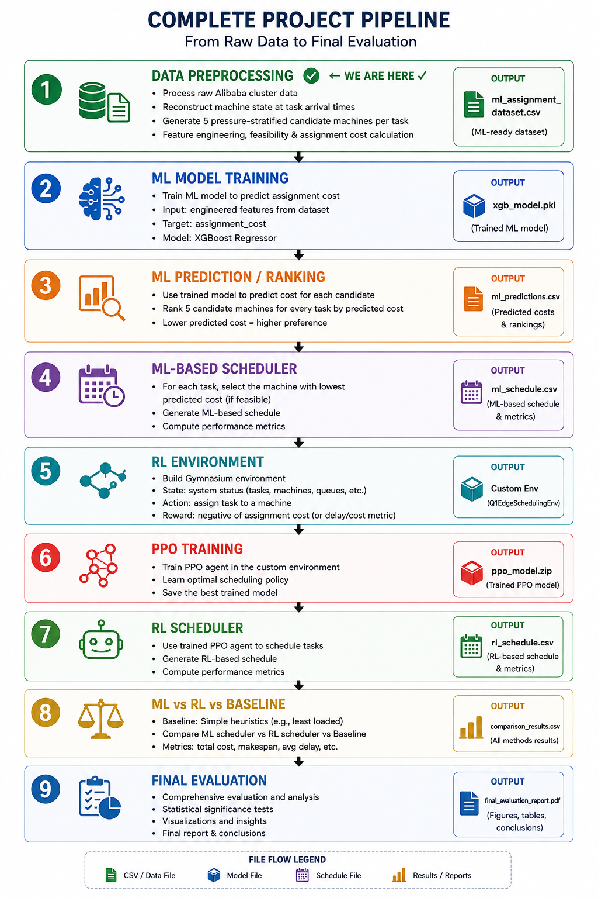
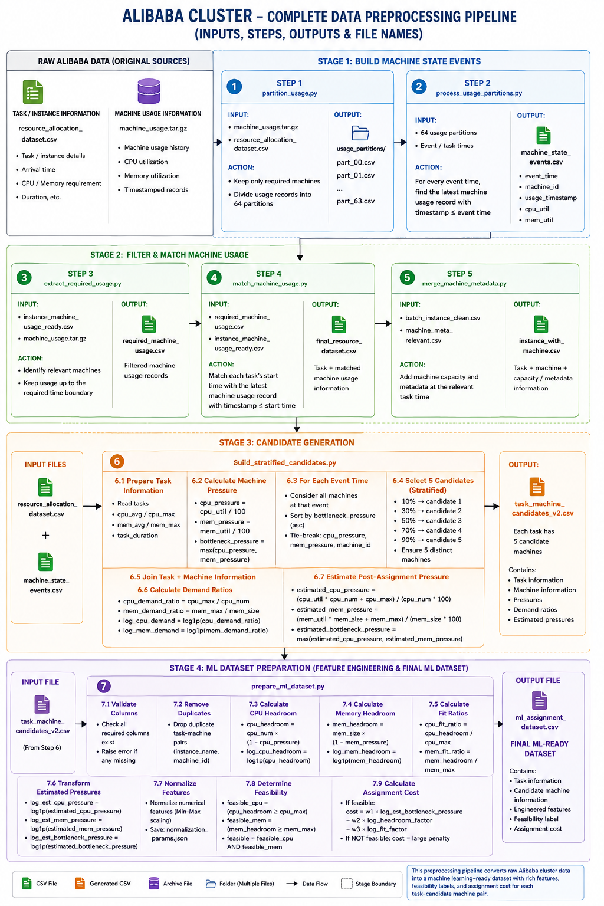

# Machine Learning and Reinforcement Learning Based Dynamic CPU Scheduling

A hybrid Machine Learning (ML) and Reinforcement Learning (RL) based framework for dynamic CPU scheduling and resource allocation using large-scale workload and machine-resource data.

The project combines Machine Learning techniques for workload/resource analysis with Reinforcement Learning to learn dynamic scheduling decisions. The RL component models scheduling as a sequential decision-making problem and uses a PPO-based agent to optimize resource allocation according to the current system state and reward feedback.

---

## Table of Contents

- [Overview](#overview)
- [Problem Statement](#problem-statement)
- [Objectives](#objectives)
- [Proposed Approach](#proposed-approach)
- [System Architecture](#system-architecture)
- [Complete Project Pipeline](#complete-project-pipeline)
- [Machine Learning Component](#machine-learning-component)
- [Reinforcement Learning Component](#reinforcement-learning-component)
- [RL Environment](#rl-environment)
- [State Space](#state-space)
- [Action Space](#action-space)
- [Reward Function](#reward-function)
- [Dynamic Scheduling Process](#dynamic-scheduling-process)
- [Dataset](#dataset)
- [Dataset and GitHub](#dataset-and-github)
- [Project Structure](#project-structure)
- [Technologies Used](#technologies-used)
- [Installation](#installation)
- [Dataset Setup](#dataset-setup)
- [Data Processing](#data-processing)
- [Machine Learning](#machine-learning)
- [Reinforcement Learning](#reinforcement-learning)
- [Baseline Scheduling](#baseline-scheduling)
- [Evaluation](#evaluation)
- [Results](#results)
- [Visualizations](#visualizations)
- [Advantages](#advantages)
- [Limitations](#limitations)
- [Reproducibility](#reproducibility)
- [Future Improvements](#future-improvements)
- [Academic Contribution](#academic-contribution)
- [Repository](#repository)
- [Author](#author)
- [License](#license)

---

# Overview

Modern computing environments continuously receive tasks with different computational requirements while available machine resources and system conditions change dynamically.

Traditional scheduling approaches generally rely on fixed rules, heuristics, or predefined policies. Such approaches may not adapt effectively to changing workloads and resource availability.

This project proposes a hybrid ML + RL scheduling framework in which:

1. Large-scale workload and machine data is processed.
2. Relevant features are extracted and prepared.
3. Machine Learning models learn patterns from the processed data.
4. The resulting information is used as part of the scheduling pipeline.
5. A custom Reinforcement Learning environment represents the scheduling problem.
6. A PPO agent learns scheduling decisions through interaction with the environment.
7. Scheduling performance is evaluated against baseline and alternative approaches.

---

# Problem Statement

The objective of this project is to develop an intelligent and adaptive CPU scheduling framework capable of making dynamic resource allocation decisions.

The scheduler should consider changing workload and resource conditions rather than relying only on static scheduling rules.

The problem can be represented as:

```text
Incoming Tasks
      |
      v
Current Workload
      |
      v
Machine / Resource Information
      |
      v
Intelligent Scheduling
      |
      v
Resource Allocation
      |
      v
System Performance
      |
      v
Feedback
      |
      v
Improved Scheduling Policy
```

---

# Objectives

The major objectives of this project are:

- Process large-scale workload and machine-resource data.
- Construct datasets suitable for Machine Learning and Reinforcement Learning.
- Develop Machine Learning models for workload/resource-related prediction and ranking.
- Develop a custom Reinforcement Learning scheduling environment.
- Train a PPO-based Reinforcement Learning agent.
- Dynamically select appropriate resources for incoming tasks.
- Develop baseline scheduling methods for comparison.
- Evaluate ML and RL based scheduling approaches.
- Analyze scheduling performance using experimental results.
- Build a reproducible project structure for future experimentation.

---

# Proposed Approach

The proposed system consists of two major intelligent components:

```text
                    Large-Scale Dataset
                           |
                           v
                   Data Processing
                           |
                           v
                  Feature Engineering
                           |
                 +---------+---------+
                 |                   |
                 v                   v
        Machine Learning      RL Environment
                 |                   |
                 v                   v
        Prediction / Ranking    System State
                 |                   |
                 |                   v
                 |              PPO Agent
                 |                   |
                 +---------+---------+
                           |
                           v
                  Dynamic Scheduling
                           |
                           v
                  Resource Allocation
                           |
                           v
                    Reward / Metrics
                           |
                           v
                     Evaluation
```

---

# System Architecture

The overall project architecture is divided into several stages.

## Stage 1 — Data Processing

The large-scale dataset contains workload, task, machine, resource, and usage information.

The data processing pipeline prepares this information for downstream ML and RL experiments.

```text
Raw Dataset
     |
     v
Data Cleaning
     |
     v
Data Filtering
     |
     v
Data Matching
     |
     v
Feature Construction
     |
     v
Processed Dataset
```

## Stage 2 — Machine Learning

The processed data is used to train Machine Learning models.

```text
Processed Dataset
       |
       v
Feature Engineering
       |
       v
ML Training
       |
       v
Prediction / Ranking
       |
       v
Scheduling Information
```

The repository contains multiple ML training and evaluation implementations.

## Stage 3 — Reinforcement Learning

The scheduling problem is represented as an RL environment.

```text
Current System State
        |
        v
     PPO Agent
        |
        v
 Scheduling Action
        |
        v
Resource Allocation
        |
        v
Performance Evaluation
        |
        v
     Reward
        |
        v
    Next State
```

The agent learns a policy by repeatedly interacting with the environment.

---

# Complete Project Pipeline

```text
                 Large-Scale Dataset
                         |
                         v
                 Data Processing
                         |
                         v
                Feature Generation
                         |
             +-----------+-----------+
             |                       |
             v                       v
     Machine Learning       Reinforcement Learning
             |                       |
             v                       v
     Prediction / Ranking      RL Environment
             |                       |
             |                       v
             |                  State Space
             |                       |
             |                       v
             |                  PPO Agent
             |                       |
             +-----------+-----------+
                         |
                         v
                 Scheduling Decision
                         |
                         v
                  Resource Allocation
                         |
                         v
                    Reward Signal
                         |
                         v
                   Next System State
                         |
                         v
                    Evaluation
```

---

# Machine Learning Component

The project contains multiple Machine Learning components for processing, training, ranking, and evaluating scheduling-related models.

Important ML scripts include:

```text
dataset/train_ml_model.py
dataset/train_ml_model_v2.py
dataset/train_ml_ranker_v3.py

dataset/evaluate_ml_scheduler.py
dataset/evaluate_ml_ranker_v3.py

dataset/prepare_ml_dataset.py
```

The ML pipeline can be represented as:

```text
Historical Data
      |
      v
Data Processing
      |
      v
Feature Engineering
      |
      v
Training Dataset
      |
      v
Machine Learning Model
      |
      v
Prediction / Ranking
      |
      v
Scheduling Information
```

The repository also contains ML metric files:

```text
dataset/ml_model_metrics.json
dataset/ml_model_metrics_v2.json
dataset/ml_ranker_v3_metrics.json
```

These files contain experiment-specific metrics generated by the implemented ML pipelines.

---

# Reinforcement Learning Component

The Reinforcement Learning component models dynamic scheduling as a sequential decision-making problem.

The project uses a custom scheduling environment and PPO-based training.

Important RL files include:

```text
dataset/rl_scheduler_env.py
dataset/train_ppo.py
dataset/evaluate_ppo.py
dataset/evaluate_ppo_v2.py
dataset/recover_and_evaluate_ppo.py
```

The RL process is:

```text
Environment
     |
     v
Current State
     |
     v
PPO Agent
     |
     v
Scheduling Action
     |
     v
Environment
     |
     +------> Reward
     |
     +------> Next State
     |
     +------> Episode Status
```

The PPO agent learns a scheduling policy by maximizing cumulative reward.

---

# RL Environment

The scheduling environment represents the computational system and workload conditions required for making scheduling decisions.

The environment contains information related to:

- Tasks
- Computational requirements
- Machine/resource information
- Resource availability
- Queue or workload conditions
- Scheduling decisions
- System performance
- Reward generation

The environment follows the standard Gymnasium-style interaction:

```text
reset()
   |
   v
Initial State
   |
   v
Agent selects Action
   |
   v
step(Action)
   |
   +------> Reward
   |
   +------> Next State
   |
   +------> Termination
```

The implementation of the environment is available in:

```text
dataset/rl_scheduler_env.py
```

---

# State Space

The RL agent receives a numerical representation of the current scheduling environment.

The state can contain information associated with:

- Task characteristics
- Computational requirements
- Machine/resource characteristics
- Current resource availability
- Workload information
- Queue information
- System conditions

The exact state representation is defined by the implementation in:

```text
dataset/rl_scheduler_env.py
```

The state is processed before being passed to the RL agent so that the different numerical features can be used effectively during training.

---

# Action Space

The action represents the scheduling decision selected by the RL agent.

Conceptually:

```text
                  Incoming Task
                       |
                       v
              Available Resources
                       |
          +------------+------------+
          |            |            |
          v            v            v
      Resource 1   Resource 2   Resource N
          |            |            |
          +------------+------------+
                       |
                       v
                 PPO Decision
                       |
                       v
              Selected Resource
```

The exact action encoding is defined by the RL environment implementation.

---

# Reward Function

The reward provides feedback to the RL agent after a scheduling decision.

The purpose of the reward is to encourage scheduling decisions that improve system performance.

Depending on the implemented environment and experiment, scheduling performance can involve factors such as:

- Execution time
- Latency
- Resource utilization
- Energy consumption
- Queueing
- Scheduling efficiency
- Task completion

Conceptually:

```text
Good Scheduling Decision
          |
          v
Better System Performance
          |
          v
Higher Reward
```

Poor scheduling decisions produce lower rewards.

The exact reward calculation used by the project is implemented in:

```text
dataset/rl_scheduler_env.py
```

---

# Dynamic Scheduling Process

The dynamic scheduling process follows these steps:

```text
1. Task arrives
        |
        v
2. Current system state is observed
        |
        v
3. State is provided to the RL agent
        |
        v
4. Agent selects an action
        |
        v
5. Task is assigned according to the action
        |
        v
6. System performance is evaluated
        |
        v
7. Reward is calculated
        |
        v
8. Environment moves to the next state
        |
        v
9. Agent learns from the experience
```

This process is repeated throughout RL training.

---

# Dataset

The project uses a large-scale dataset containing workload, task, machine, usage, and resource-related information.

The project contains data-processing scripts for transforming the original data into datasets required for Machine Learning and Reinforcement Learning experiments.

Examples of processed data include:

```text
batch_instance_clean.csv
batch_instance_sample.csv
machine_meta_relevant.csv
machine_meta_sample.csv
machine_usage_sample.csv
machine_state_events.csv
resource_allocation_dataset.csv
ml_assignment_dataset.csv
task_machine_candidates.csv
```

The project also generates partitioned datasets during data processing.

---

# Dataset and GitHub

The complete dataset used by the project is approximately **20 GB**.

The complete dataset is intentionally **not uploaded to GitHub**.

Instead:

```text
Local Project
│
├── Source Code             → GitHub
├── Documentation           → GitHub
├── Metrics                 → GitHub
├── Project Diagrams        → GitHub
│
└── Large Dataset (~20 GB)  → Local Only
```

The `.gitignore` file prevents large dataset files from being tracked by Git.

Ignored files include:

- Large CSV files
- Dataset partitions
- TAR/TAR.GZ archives
- ZIP archives
- Large generated datasets
- Large model checkpoints
- Training logs
- Virtual environments

The dataset remains physically inside the project directory on the development machine.

---

# Project Structure

```text
ML-RL-Dynamic-CPU-Scheduling/
│
├── .gitignore
├── README.md
│
├── environment.py
├── train.py
├── test.py
├── merge_machine_metadata.py
├── project_definition.txt
│
├── dataset/
│   │
│   ├── align_machine_usage.py
│   ├── app.py
│   ├── baseline_scheduler.py
│   ├── build_candidates.py
│   ├── build_machine_state_events.py
│   ├── build_stratified_candidates.py
│   ├── build_usage_database.py
│   ├── extract_required_usage.py
│   ├── inspect_instance.py
│   ├── match_machine_usage.py
│   ├── merge_machine_metadata.py
│   ├── partition_usage.py
│   ├── prepare_ml_dataset.py
│   └── process_usage_partitions.py
│
│   ├── train_ml_model.py
│   ├── train_ml_model_v2.py
│   ├── train_ml_ranker_v3.py
│   ├── evaluate_ml_scheduler.py
│   └── evaluate_ml_ranker_v3.py
│
│   ├── rl_scheduler_env.py
│   ├── train_ppo.py
│   ├── evaluate_ppo.py
│   ├── evaluate_ppo_v2.py
│   └── recover_and_evaluate_ppo.py
│
│   ├── ml_model_metrics.json
│   ├── ml_model_metrics_v2.json
│   └── ml_ranker_v3_metrics.json
│
│   └── Large Dataset Files
│       └── Excluded from GitHub
│
├── COMPLETE_PROJECT_PIPELINE.png
├── DATA PROCESSING PIPE LINE.png
├── DATA_PROCESSING_PIPE_LINE_INDETAIL.png
├── RL WORK FLOW.png
├── ml model comparision.png
├── model m2.png
└── New Microsoft Word Document.docx
```

---

# Technologies Used

## Programming Language

- Python

## Machine Learning

- XGBoost
- Scikit-learn
- Pandas
- NumPy

## Reinforcement Learning

- Stable-Baselines3
- Gymnasium
- PPO

## Deep Learning

- PyTorch

## Development and Version Control

- Git
- GitHub
- Python Virtual Environment

---

# Installation

## 1. Clone the Repository

```bash
git clone https://github.com/rohithurlapu18/ML-RL-Dynamic-CPU-Scheduling.git
```

Move into the project directory:

```bash
cd ML-RL-Dynamic-CPU-Scheduling
```

## 2. Create a Virtual Environment

### Windows

```bash
python -m venv .venv
```

Activate:

```bash
.venv\Scripts\activate
```

### Linux / macOS

```bash
python3 -m venv .venv
source .venv/bin/activate
```

## 3. Install Dependencies

```bash
pip install -r requirements.txt
```

Make sure `requirements.txt` is maintained with the versions required by the current implementation.

---

# Dataset Setup

Because the complete dataset is not included in GitHub, it must be obtained separately.

After obtaining the dataset, place the required files in the appropriate project directories.

Example:

```text
ML-RL-Dynamic-CPU-Scheduling/
│
└── dataset/
    │
    ├── raw dataset files
    │
    ├── usage_partitions/
    │   ├── part_00.csv
    │   ├── part_01.csv
    │   ├── ...
    │   └── part_63.csv
    │
    └── other processed data
```

The exact files required depend on the processing stage and script being executed.

---

# Data Processing

The project contains multiple scripts for preparing and processing the large dataset.

Examples include:

```bash
python dataset/prepare_ml_dataset.py
```

```bash
python dataset/process_usage_partitions.py
```

```bash
python dataset/build_candidates.py
```

```bash
python dataset/build_machine_state_events.py
```

The exact execution order may depend on the available dataset files and the experiment being performed.

---

# Machine Learning

## Train ML Model

```bash
python dataset/train_ml_model.py
```

An alternative ML implementation:

```bash
python dataset/train_ml_model_v2.py
```

## Train ML Ranking Model

```bash
python dataset/train_ml_ranker_v3.py
```

## Evaluate ML Scheduler

```bash
python dataset/evaluate_ml_scheduler.py
```

## Evaluate ML Ranker

```bash
python dataset/evaluate_ml_ranker_v3.py
```

---

# Reinforcement Learning

## RL Environment

The custom scheduling environment is implemented in:

```text
dataset/rl_scheduler_env.py
```

## Train PPO Agent

```bash
python dataset/train_ppo.py
```

The PPO training process interacts with the custom environment and learns a scheduling policy through repeated episodes.

## Evaluate PPO

```bash
python dataset/evaluate_ppo.py
```

Additional evaluation:

```bash
python dataset/evaluate_ppo_v2.py
```

Recovery/evaluation functionality:

```bash
python dataset/recover_and_evaluate_ppo.py
```

---

# Baseline Scheduling

The project also contains a baseline scheduling implementation:

```text
dataset/baseline_scheduler.py
```

This can be used to establish a reference point for comparing the proposed ML/RL scheduling approaches.

```text
              Scheduling Approaches
                       |
       +---------------+---------------+
       |               |               |
       v               v               v
   Baseline           ML             RL/PPO
       |               |               |
       +---------------+---------------+
                       |
                       v
              Performance Analysis
```

---

# Evaluation

The project evaluates different components using experiment-specific metrics and output files.

ML evaluation can include:

- Model metrics
- Prediction performance
- Ranking performance
- Scheduling results

RL evaluation can include:

- Episode reward
- Scheduling performance
- Resource allocation behavior
- PPO evaluation results

The repository contains metric files such as:

```text
dataset/ml_model_metrics.json
dataset/ml_model_metrics_v2.json
dataset/ml_ranker_v3_metrics.json
```

Additional experiment outputs are generated during local execution.

---

# Results

The repository contains experiment outputs for comparing the developed scheduling approaches.

Examples include:

- ML model metrics
- ML ranking metrics
- ML scheduler results
- PPO results
- PPO v2 results

The numerical values should be interpreted directly from the corresponding generated metric and result files.

No performance values are assumed in this README unless they are explicitly produced by the project experiments.

---

# Visualizations

The repository contains diagrams describing the project architecture, data processing, and reinforcement learning workflow.

## Complete Project Pipeline



## Data Processing Pipeline


## Detailed Data Processing Pipeline



## Reinforcement Learning Workflow


## ML Model Comparison


---

# Advantages

The proposed hybrid ML + RL approach provides several potential advantages:

- Data-driven scheduling
- Dynamic resource allocation
- Adaptive scheduling decisions
- Learning from historical system information
- Learning from environment feedback
- Reduced dependence on fixed scheduling rules
- Ability to model scheduling as a sequential decision-making problem
- Comparison between baseline, ML, and RL approaches

---

# Limitations

The current project has several limitations:

- The complete dataset is large and therefore not included in GitHub.
- Training large ML/RL models can require significant computational resources.
- RL training can require many environment steps.
- RL performance depends strongly on state representation and reward design.
- Results can vary with training configuration and random seed.
- The scheduling environment is a simulation/model of the scheduling problem rather than a production operating-system CPU scheduler.
- Reproducing all experiments requires access to the complete dataset.

---

# Reproducibility

For reproducible experiments, record:

```text
Python Version:
NumPy Version:
Pandas Version:
Scikit-learn Version:
XGBoost Version:
PyTorch Version:
Gymnasium Version:
Stable-Baselines3 Version:
```

Also record:

```text
Dataset Version:
Random Seed:
ML Model Configuration:
RL Algorithm:
PPO Hyperparameters:
Training Steps:
Evaluation Configuration:
```

This allows future experiments to be reproduced more reliably.

---

# Future Improvements

Possible future improvements include:

1. Improve workload and resource prediction.
2. Experiment with additional Machine Learning algorithms.
3. Compare PPO with other suitable Reinforcement Learning algorithms.
4. Improve reward shaping.
5. Introduce additional resource constraints.
6. Add more realistic scheduling conditions.
7. Perform hyperparameter optimization.
8. Add multiple scheduling objectives.
9. Introduce multi-agent reinforcement learning.
10. Improve large-scale experiment automation.
11. Develop a real-time scheduling visualization dashboard.
12. Compare against additional classical scheduling algorithms.
13. Improve reproducibility using configuration files and fixed random seeds.
14. Evaluate the approach on additional workload datasets.

---

# Academic Contribution

The project demonstrates the application of Machine Learning and Reinforcement Learning to dynamic CPU scheduling.

The main contribution is the integration of:

```text
Large-Scale Data Processing
          +
Machine Learning
          +
Reinforcement Learning
          +
Dynamic Scheduling
          +
Performance Evaluation
```

This provides a framework for investigating intelligent scheduling policies under changing workload and resource conditions.

---

# Repository

GitHub Repository:

https://github.com/rohithurlapu18/ML-RL-Dynamic-CPU-Scheduling

---

# Author

**Rohith Urlapu**

Vellore Institute of Technology, Chennai

GitHub:

https://github.com/rohithurlapu18

---

# License

This project is developed for academic and research purposes.

If the project is intended for public redistribution or reuse, an appropriate open-source license should be added to the repository.

---

# Acknowledgements

This project uses open-source Python libraries and frameworks including:

- NumPy
- Pandas
- Scikit-learn
- XGBoost
- PyTorch
- Gymnasium
- Stable-Baselines3

The project demonstrates the application of these technologies to intelligent dynamic CPU scheduling.
